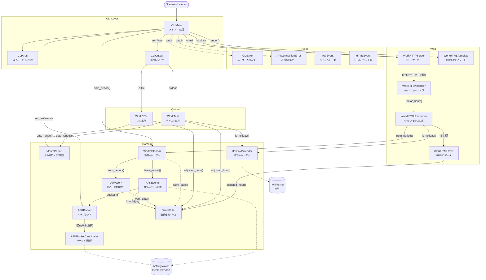
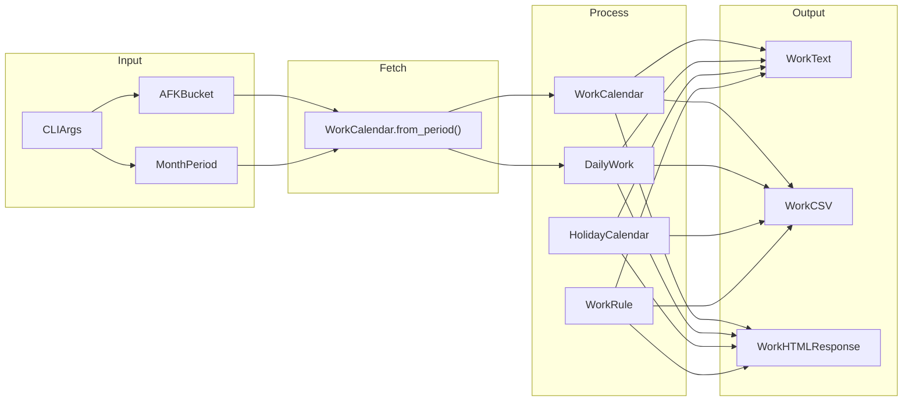
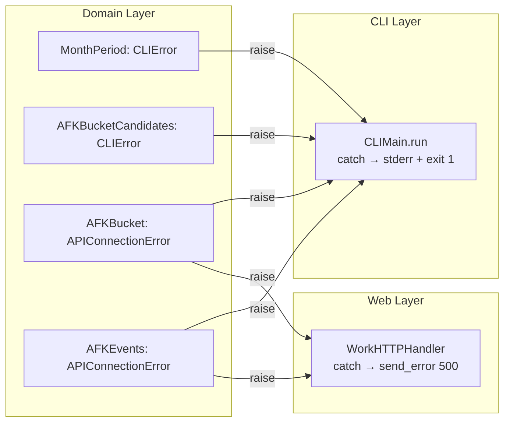

# Architecture

## File Sections

```
TYPES   — CLIError / APIConnectionError / AWEvent / HTMLEvent
DOMAIN  — WorkRule / MonthPeriod / AFKBucketCandidates / AFKBucket / AFKEvents / HolidayCalendar / DailyWork / WorkCalendar
OUTPUT  — WorkCSV / WorkText
WEB     — WorkHTMLRow / WorkHTMLResponse / WorkHTTPHandler / WorkHTTPServer / WorkHTMLTemplate
CLI     — CLIArgs / CLIOutput / CLIMain
```

## Class Diagram (18 classes + 4 types)



## Processing Flow



## Exception Flow



## Class Summary

| # | Section | Class | Methods | Role |
|---|---------|-------|---------|------|
| - | TYPES | CLIError | - | User input error |
| - | TYPES | APIConnectionError | - | AW API connection error |
| - | TYPES | AWEvent | - | AFK event TypedDict |
| - | TYPES | HTMLEvent | - | HTML event TypedDict |
| 1 | DOMAIN | WorkRule | 4 | Work day boundary, block split, adjusted hour, span |
| 2 | DOMAIN | MonthPeriod | 5 | Month period parsing and date range generation |
| 3 | DOMAIN | AFKBucketCandidates | 5 | AFK bucket selection from candidates |
| 4 | DOMAIN | AFKBucket | 4 | Bucket ID caching and resolution |
| 5 | DOMAIN | AFKEvents | 5 | AFK event fetching and work block extraction |
| 6 | DOMAIN | HolidayCalendar | 6 | Japanese holiday lookup with file cache |
| 7 | DOMAIN | DailyWork | 4 | Daily active time and max gap calculation |
| 8 | DOMAIN | WorkCalendar | 5 | Work calendar from event blocks (+ from_period) |
| 9 | OUTPUT | WorkCSV | 5 | CSV format output |
| 10 | OUTPUT | WorkText | 5 | Text format output |
| 11 | WEB | WorkHTMLRow | 5 | Per-day row data for HTML |
| 12 | WEB | WorkHTMLResponse | 4 | JSON API response for HTML frontend |
| 13 | WEB | WorkHTTPHandler | 6 | HTTP request routing and proxy |
| 14 | WEB | WorkHTTPServer | 6 | HTTP server lifecycle management |
| 15 | WEB | WorkHTMLTemplate | 5 | HTML page template (CSS/JS/controls) |
| 16 | CLI | CLIArgs | 9 | CLI argument parsing and properties |
| 17 | CLI | CLIOutput | 5 | Output dispatch (CSV or text) |
| 18 | CLI | CLIMain | 6 | Application entry point |
