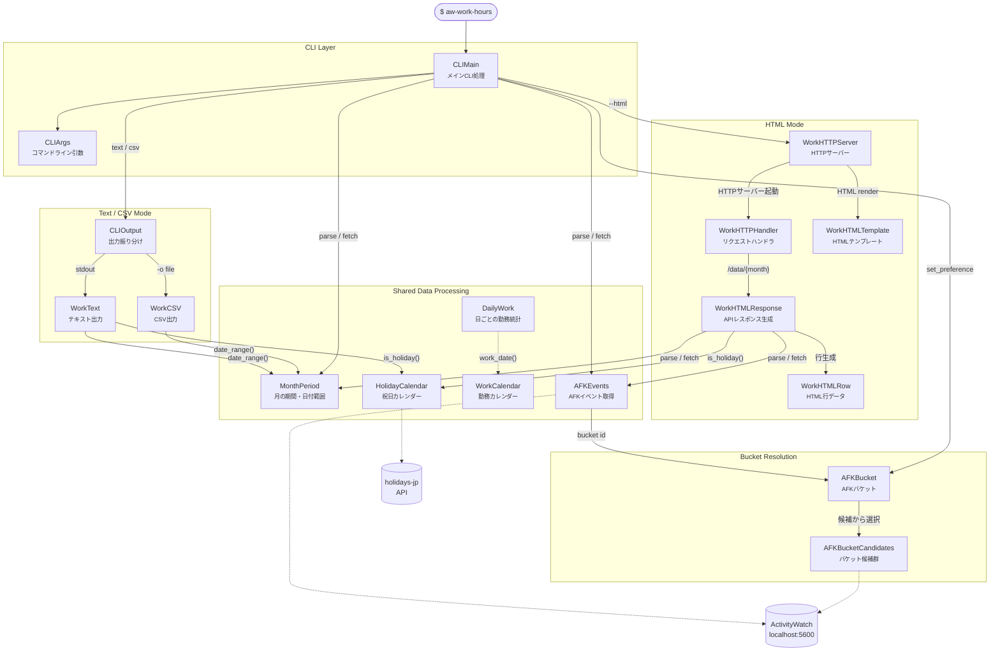
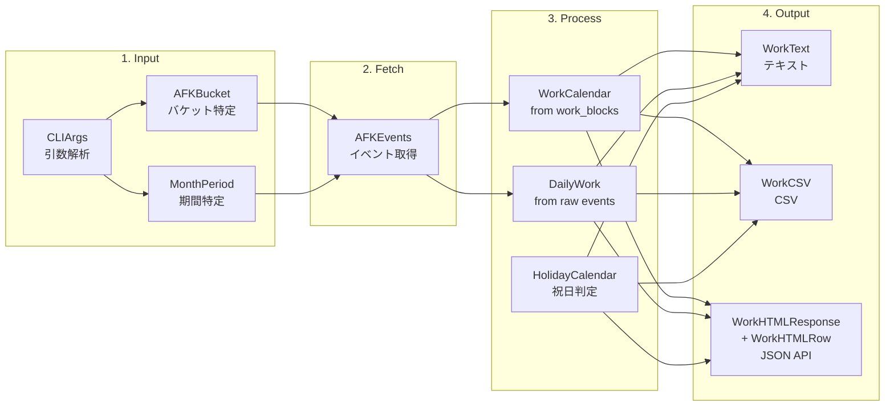

# Architecture

## Class Diagram (17 classes)

## Processing Flow

## Class Summary

| # | Class | Methods | Role |
|---|-------|---------|------|
| 1 | AFKBucketCandidates | 5 | AFK bucket selection from candidates |
| 2 | AFKBucket | 4 | Bucket ID caching and resolution |
| 3 | MonthPeriod | 5 | Month period parsing and date range generation |
| 4 | AFKEvents | 5 | AFK event fetching and work block extraction |
| 5 | DailyWork | 4 | Daily active time and max gap calculation |
| 6 | HolidayCalendar | 6 | Japanese holiday lookup with file cache |
| 7 | WorkCalendar | 5 | Work calendar from event blocks |
| 8 | WorkCSV | 5 | CSV format output |
| 9 | WorkText | 5 | Text format output |
| 10 | WorkHTMLTemplate | 5 | HTML page template (CSS/JS/controls) |
| 11 | WorkHTMLRow | 6 | Per-day row data for HTML |
| 12 | WorkHTMLResponse | 4 | JSON API response for HTML frontend |
| 13 | WorkHTTPHandler | 5 | HTTP request routing and proxy |
| 14 | WorkHTTPServer | 5 | HTTP server lifecycle management |
| 15 | CLIArgs | 8 | CLI argument parsing and properties |
| 16 | CLIOutput | 4 | Output dispatch (CSV or text) |
| 17 | CLIMain | 5 | Application entry point |
