# Architecture

## 概要

ActivityWatch の AFK（離席）データから日ごとの勤務時間を算出するツール。
外部ライブラリ依存なし（Python 3.9+ 標準ライブラリのみ）の単一ファイル CLI。

- **テキスト/CSVモード** — ターミナルに勤務時間を出力、またはCSVファイルに保存
- **HTMLモード** — ローカルHTTPサーバーを起動し、ブラウザでタイムライン表示

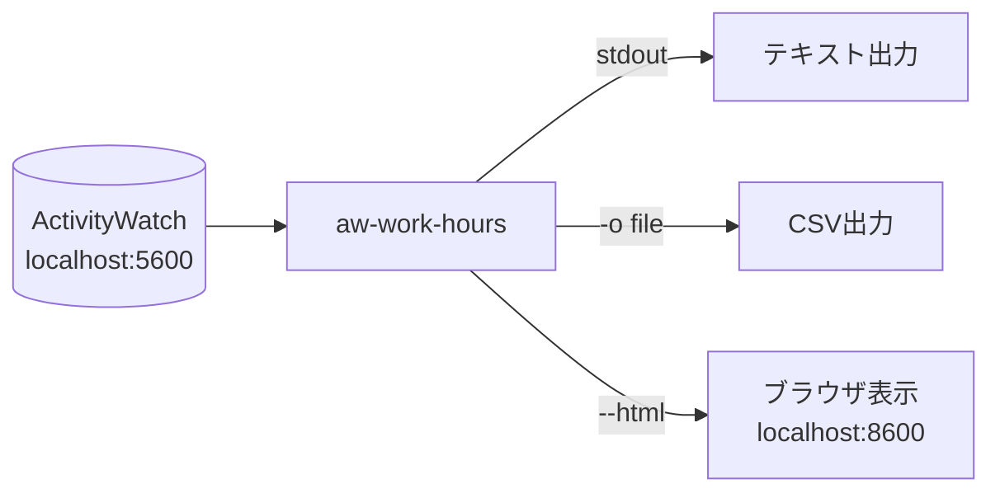

## ディレクトリ構成

```
aw-work-hours/
├── aw-work-hours           ← 本体（Python 単一ファイル 1173行）
├── web/                    ← フロントエンド
│   ├── index.html          ←   Tailwind CSS CDN ベースのUI
│   ├── app.js              ←   月ナビ・テーブル描画・設定ダイアログ
│   └── app.css             ←   タイムラインバー・ツールチップ
├── tests/
│   ├── conftest.py         ←   モジュールローダー・状態リセット
│   └── test_stdout.py      ←   13ヶ月分の回帰テスト
├── fixtures/
│   ├── api/                ←   ActivityWatch APIモックデータ
│   │   ├── buckets.json
│   │   └── events/*.json   ←   2025-01 〜 2026-01
│   ├── expected/*.txt      ←   期待されるstdout出力
│   └── holidays/*.json     ←   祝日キャッシュ
└── docs/
    └── architecture.md     ←   本ドキュメント
```

## レイヤー構成

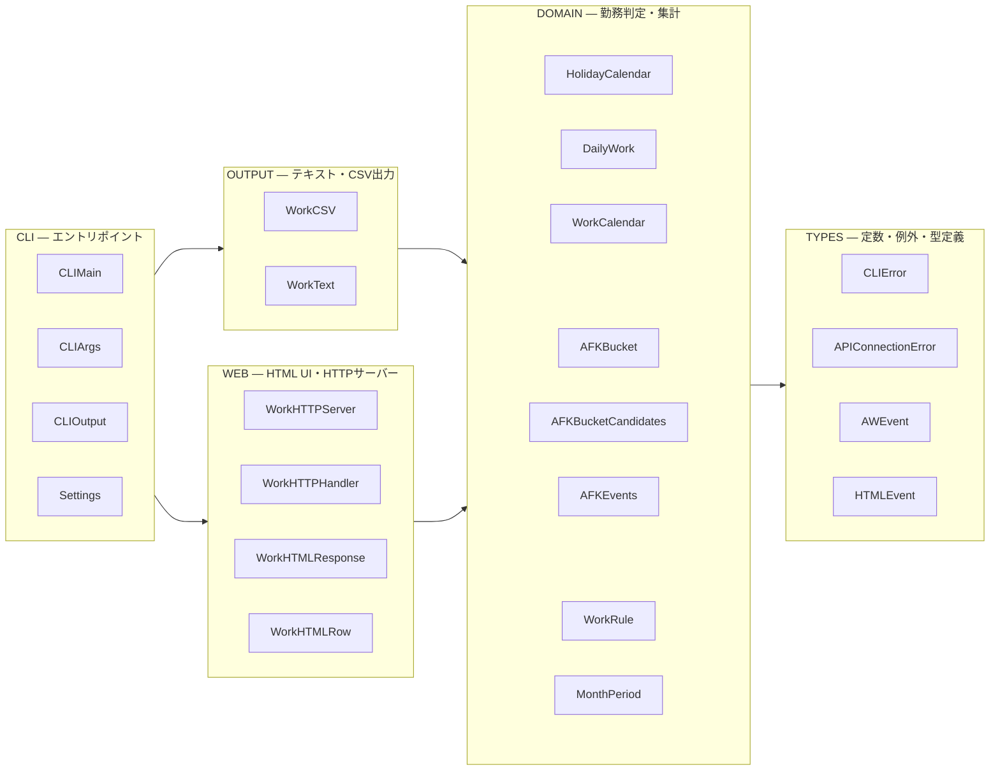

| レイヤー | 行範囲 | 責務 | 公開API |
|---------|--------|------|---------|
| TYPES | 34-68 | 定数・例外・TypedDict | `_API_BASE`, `_TIMEZONE`, `_WEEKDAYS` |
| Settings | 70-116 | 永続設定（`~/.config/aw-work-hours/settings.json`） | `Settings.save()`, プロパティ群 |
| DOMAIN | 118-549 | 勤務日判定・API取得・集計 | `WorkCalendar.from_period()` |
| OUTPUT | 551-667 | テキスト/CSV整形 | `WorkCSV.content()`, `WorkText.content()` |
| WEB | 669-963 | HTTPサーバー・JSON API | `WorkHTTPServer.start()` |
| CLI | 965-1172 | 引数解析・実行制御 | `CLIMain().run()` |

## クラス図 — テキスト/CSVモード

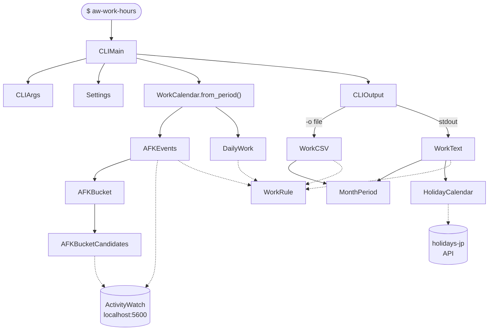

## クラス図 — HTMLモード

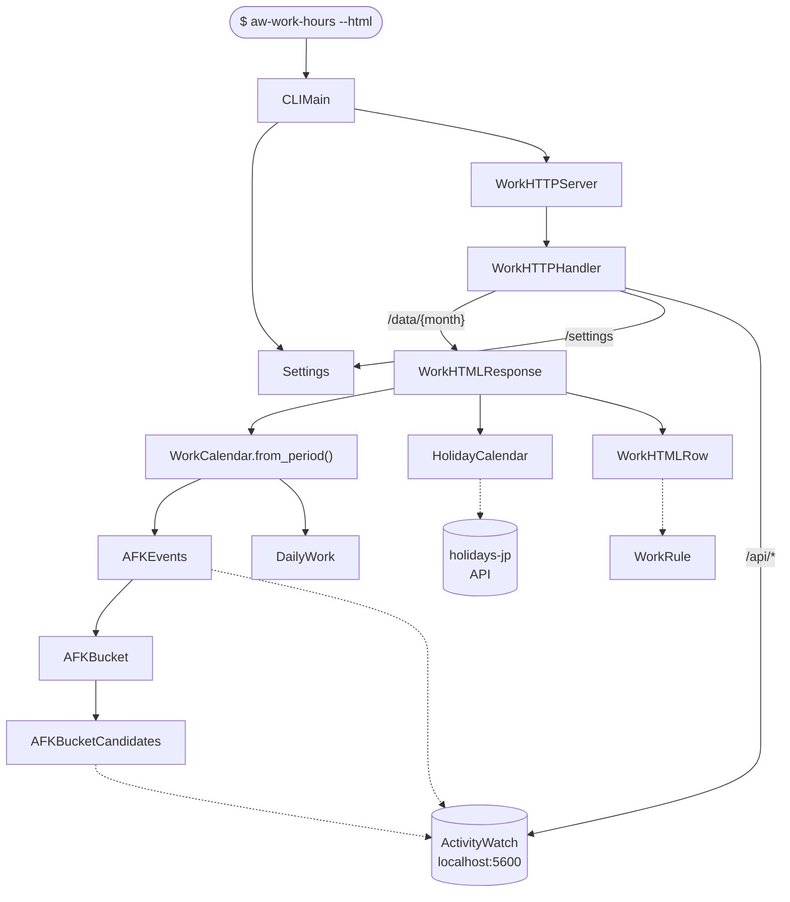

## クラス依存一覧

| クラス | 依存先 | 利用元 |
|-------|-------|-------|
| WorkRule | — | AFKEvents, DailyWork, WorkCalendar, WorkCSV, WorkText, WorkHTMLRow |
| MonthPeriod | — | CLIMain, WorkCSV, WorkText, WorkHTMLResponse |
| AFKBucketCandidates | ActivityWatch API | AFKBucket |
| AFKBucket | AFKBucketCandidates | AFKEvents, CLIMain, WorkHTTPHandler |
| AFKEvents | AFKBucket, WorkRule, ActivityWatch API | WorkCalendar, WorkHTMLResponse |
| HolidayCalendar | holidays-jp API | WorkText, WorkHTMLResponse |
| DailyWork | WorkRule | CLIOutput, WorkHTMLResponse |
| WorkCalendar | AFKEvents, DailyWork, WorkRule | CLIMain, CLIOutput, WorkHTMLResponse |
| Settings | — | CLIMain, WorkHTTPHandler |
| WorkCSV | WorkRule, MonthPeriod | CLIOutput |
| WorkText | WorkRule, MonthPeriod, HolidayCalendar | CLIOutput |
| WorkHTMLRow | WorkRule, WorkCalendar, DailyWork, HolidayCalendar | WorkHTMLResponse |
| WorkHTMLResponse | WorkCalendar, DailyWork, HolidayCalendar, WorkHTMLRow | WorkHTTPHandler |
| WorkHTTPHandler | Settings, AFKBucket, MonthPeriod, WorkHTMLResponse | WorkHTTPServer |
| WorkHTTPServer | WorkHTTPHandler | CLIMain |
| CLIArgs | — | CLIMain |
| CLIOutput | WorkCSV, WorkText, HolidayCalendar | CLIMain |
| CLIMain | 全クラス | エントリポイント |

## データフロー — テキスト/CSVモード

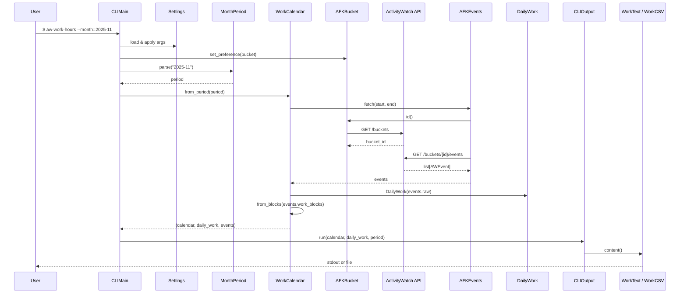

## データフロー — HTMLモード

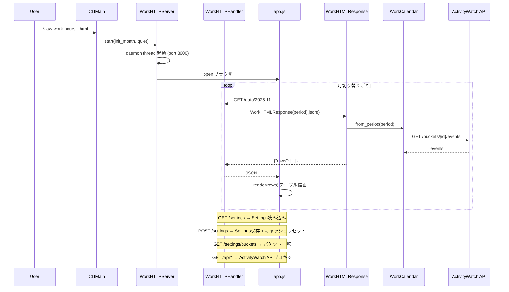

## 勤務日判定ルール（WorkRule）

### 日境界

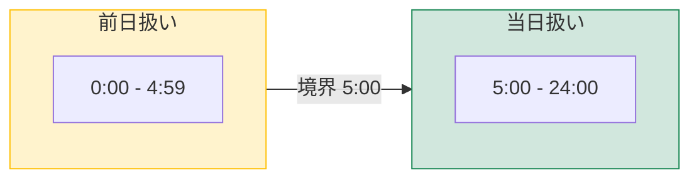

| 時刻 | 勤務日 | ルール |
|------|--------|--------|
| 1/15 09:00 | 1/15 | 通常（5:00以降 → 当日） |
| 1/16 02:30 | **1/15** | 0:00-4:59 → 前日扱い |
| 1/16 05:00 | 1/16 | 5:00以降 → 当日 |

```python
WorkRule.work_date(dt) = (dt - 1日).date()  if 0 <= dt.hour < 5  else dt.date()
```

### ブロック分割

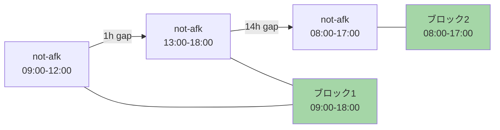

**分割条件**: gap > 3時間 **かつ** 再開時刻 ≥ 5:00 → 新ブロック

同一日に複数ブロックがある場合はマージ（最早start〜最遅end）。

### イベントフィルタ

```
AWEvent (not-afk, duration ≥ MIN_EVENT_SECONDS) → 勤務イベント
                                 ↓
              デフォルト 150秒（2.5分）未満は除外
```

### 24時超え表記

日をまたぐ勤務は `25:00`, `26:30` のように表記：

```
adjusted_hour(dt, base_date) = dt.hour + (dt.date() - base_date).days × 24
```

例: base=1/15, dt=1/16 02:30 → `26:30`

## 外部API

### ActivityWatch API (`http://127.0.0.1:5600/api/0`)

| 用途 | エンドポイント | 呼び出し元 | タイムアウト |
|------|--------------|-----------|------------|
| バケット一覧 | `GET /buckets` | `AFKBucket._fetch_ids()` | 10秒 |
| 最新イベント | `GET /buckets/{id}/events?limit=1` | `AFKBucketCandidates._last_event()` | 5秒 |
| 期間イベント | `GET /buckets/{id}/events?limit=-1&start=...&end=...` | `AFKEvents.fetch()` | 30秒 |
| APIプロキシ | `GET /api/*`（Web経由） | `WorkHTTPHandler._proxy_api()` | 30秒 |

**レスポンス形式（イベント）**:
```json
[{"timestamp": "2025-01-06T09:20:00+00:00", "duration": 33120.0, "data": {"status": "not-afk"}}]
```

**エラー時**: `APIConnectionError` を raise → CLI: stderr + exit 1 / Web: HTTP 500

### holidays-jp API (`https://holidays-jp.github.io/api/v1/{year}/date.json`)

| 用途 | 呼び出し元 | タイムアウト |
|------|-----------|------------|
| 年の祝日一覧 | `HolidayCalendar._fetch_and_cache()` | 10秒 |

**レスポンス形式**:
```json
{"2025-01-01": "元日", "2025-01-13": "成人の日"}
```

**エラー時**: 空のsetを返す（非致命的 — 祝日マーク `*` が表示されないだけ）

## Settings（設定）

### ファイル

`~/.config/aw-work-hours/settings.json`

```json
{
  "no_colon": false,
  "min_event_seconds": 150,
  "bucket": "PC-MC2408N0009B"
}
```

| キー | 型 | デフォルト | 効果 |
|------|---|---------|------|
| `no_colon` | bool | false | 時刻表示を `09:20` → `0920` に変更 |
| `min_event_seconds` | int | 150 | この秒数未満のイベントを除外 |
| `bucket` | str \| null | null | AFKバケットのホスト名指定（null=自動選択） |

### 設定反映フロー

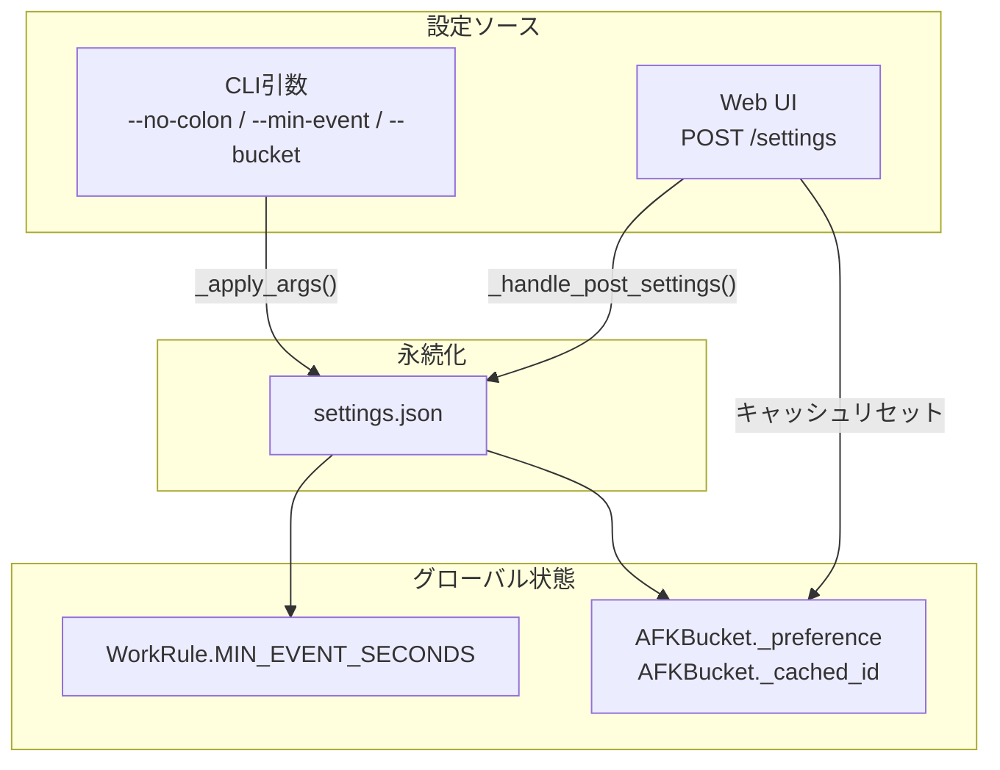

## 例外フロー

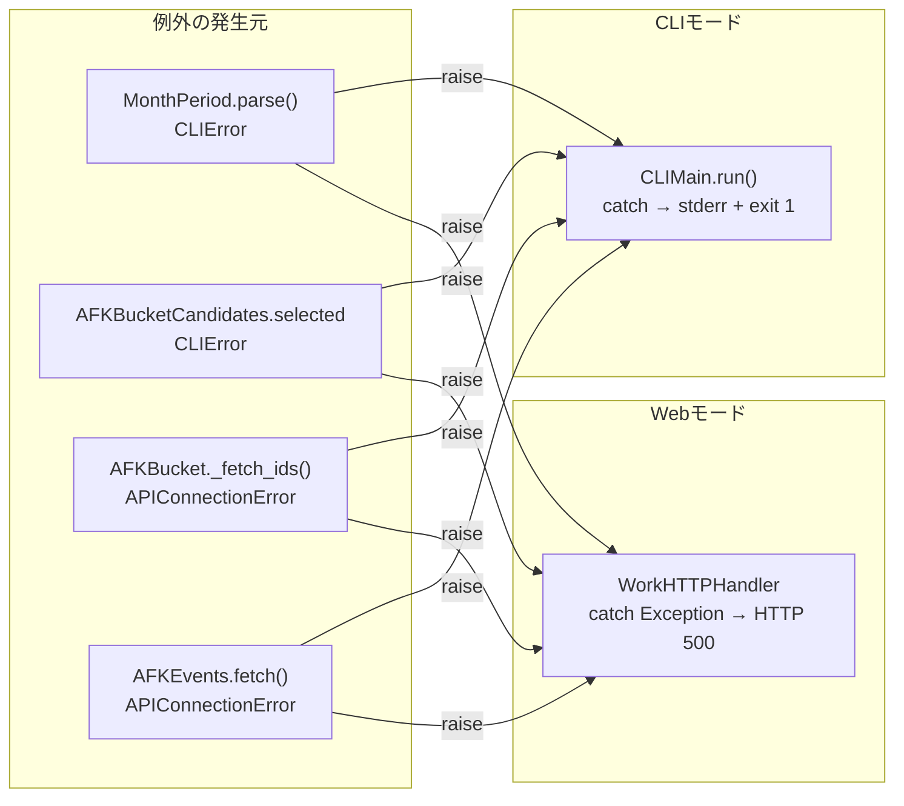

**非致命的エラー**（catchして継続）:

| 場所 | 例外 | 処理 |
|------|------|------|
| `HolidayCalendar._fetch_and_cache()` | `URLError` | 空setを返す（祝日マークなし） |
| `AFKBucketCandidates._last_event()` | `URLError` / `KeyError` / `IndexError` | Noneを返す（ランキング対象外） |

## キャッシュ戦略

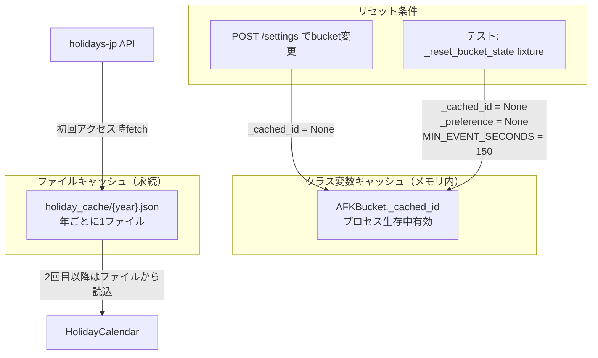

## フロントエンド構成（web/）

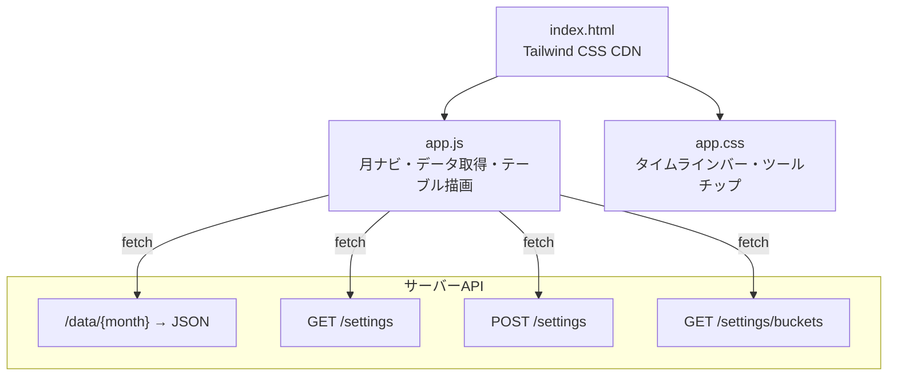

**UIコンポーネント**:

| 要素 | 説明 |
|------|------|
| 月ナビ | `<` 前月 / `<input type="month">` / 次月 `>` |
| コロンなしチェック | テーブル内の時刻表示を `0920` 形式に切替 |
| 設定ダイアログ | コロンなし / 最小イベント秒数 / AFKバケット選択 |
| テーブル | 日付・時刻・勤務時間・AFK時間・24hタイムラインバー |
| タイムラインバー | 緑のバーで not-afk 区間を表示、ホバーでツールチップ |

## テスト構成

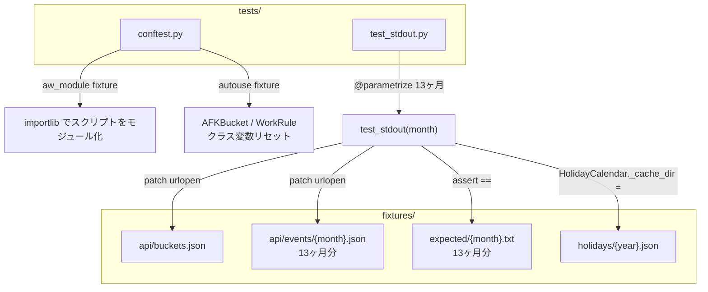

**テスト戦略**:
- API呼び出しを `unittest.mock.patch` でfixtureに差し替え
- `WorkCalendar.from_period()` → `WorkText.content()` の出力を期待値と比較
- 13ヶ月分（2025-01〜2026-01）をパラメタライズ実行

## クラス一覧

| # | レイヤー | クラス | メソッド数 | 役割 |
|---|---------|--------|----------|------|
| - | TYPES | CLIError | - | ユーザー入力エラー |
| - | TYPES | APIConnectionError | - | API接続エラー |
| - | TYPES | AWEvent | - | AFK イベント TypedDict |
| - | TYPES | HTMLEvent | - | HTML イベント TypedDict |
| 1 | CONFIG | Settings | 3+3prop | 永続設定の読み書き |
| 2 | DOMAIN | WorkRule | 4 static | 勤務日判定・時間計算 |
| 3 | DOMAIN | MonthPeriod | 4 | 月の期間解析と日付範囲生成 |
| 4 | DOMAIN | AFKBucketCandidates | 4 | バケット候補の選択 |
| 5 | DOMAIN | AFKBucket | 4 class | バケットIDのキャッシュと解決 |
| 6 | DOMAIN | AFKEvents | 4 | イベント取得とwork block抽出 |
| 7 | DOMAIN | HolidayCalendar | 5 | 祝日判定（ファイルキャッシュ付き） |
| 8 | DOMAIN | DailyWork | 3 | 日別 active 時間・最大 gap 算出 |
| 9 | DOMAIN | WorkCalendar | 4 | 勤務カレンダー（`from_period` が計算入口） |
| 10 | OUTPUT | WorkCSV | 4 | CSV 出力 |
| 11 | OUTPUT | WorkText | 4 | テキスト出力 |
| 12 | WEB | WorkHTMLRow | 4 | HTML用の日別行データ生成 |
| 13 | WEB | WorkHTMLResponse | 4 | JSON APIレスポンス生成 |
| 14 | WEB | WorkHTTPHandler | 8 | HTTPルーティング・プロキシ |
| 15 | WEB | WorkHTTPServer | 5 | HTTPサーバーのライフサイクル管理 |
| 16 | CLI | CLIArgs | 1+7prop | コマンドライン引数解析 |
| 17 | CLI | CLIOutput | 4 | 出力先振り分け（CSV or テキスト） |
| 18 | CLI | CLIMain | 6 | エントリポイント |
